# ZENZO (ZNZ) Masternode VPS Installation

This masternode installation script vastly simplifies the setup of a ZENZO (ZNZ) masternode running on a virtual private server (VPS) and it also adds a number of other powerful features, including:

* IPv6 Support
* Installs 1-100 (or more!) ZENZO (ZNZ) masternodes in parallel on one VPS, with individual zenzo.conf and data directories
* It can install masternodes for other coins on the same VPS as ZENZO (ZNZ)
* 100% auto-compilation and 99% of configuration on the masternode side of things
* Automatically compiling from the latest ZENZO release tag, or another tag can be specified
* Some security hardening is done, including firewalling and a separate user, increasing security
* Automatic startup for all masternode daemons

Some Notes and Requirements:

* Script has only been tested on a Vultr VPS, but should work almost anywhere where IPv6 addresses are available
* Currently only Ubuntu 16.04, 18.04 LTS Linux is supported
* This script needs to run as root or with sudo, the masternodes will and should not!

This project was forked from https://github.com/masternodes/vps and https://github.com/liray-unendlich/vps. @marsmensch (Florian) is the primary author behind this VPS installation script for masternodes. If you would like to donate to him, you can use the BTC address below

```
BTC  33ENWZ9RCYBG7nv6ac8KxBUSuQX64Hx3x3
```

# Install Guide on Vultr

## How to get VPS (Virtual Private Server)

For new masternode owners, **Vultr** is recommended as a VPS hosting provider, but other providers that allow direct root SSH login access and offer Ubuntu 16.04, 18.04 LTS may work.

Feel free to use the following referral link to sign up with Vultr for VPS hosting:

<a href="https://www.vultr.com/?ref=7346198"></a>

## Deploy a New System

First, create a new VPS by clicking that small "+" button.

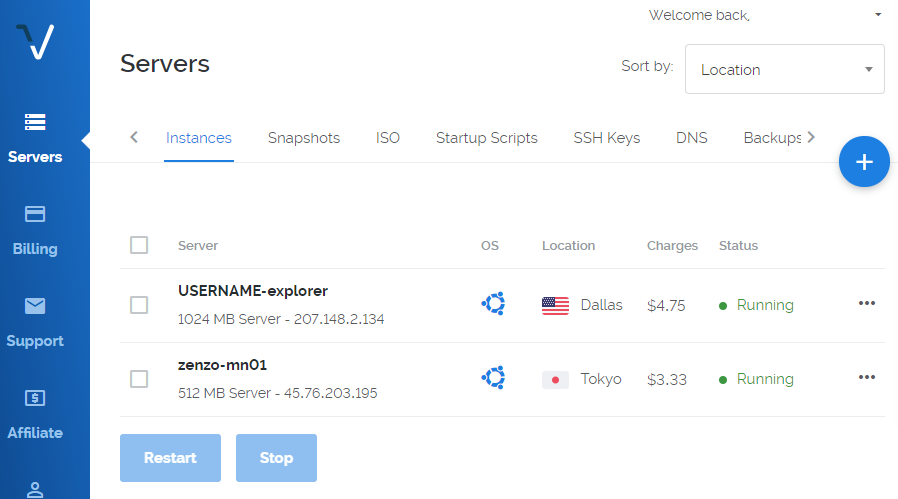

## Location Choice

You can choose any location. You may wish to have it hosted in a city/country near you, or choose a different area to help with the global decentralization of the ZENZO (ZNZ) Masternode Network.


## Linux Distribution (Ubuntu 16.04 LTS)

Select Ubuntu 16.04.


## VPS Size

The 25 GB SSD / 1024MB Memory instance is enough for 2-3 masternodes. You may need more memory, as the ZENZO (ZNZ) Blockchain grows over time, or if you want to run more masternodes.


## Activating Additional Features (IPv6)

Toggle "Enable IPv6" to activate that feature--at Vultr there is no additional cost for this.


You may wish to enable DDOS Protection to protect your masternodes against a potential denial of service attack, especially if you are running multiple masternodes from one VPS. Vultr charges an additional fee for this.

## Hostnames & Number of VPS

Choose how many instances you want and click "Deploy Now".

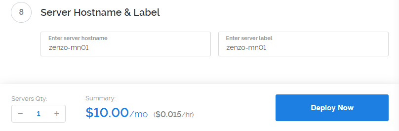

## Installation of PuTTY as SSH client (Windows)
If you are running your wallet from Windows, install PuTTY while the server is being set up. You can download PuTTY from here: http://www.putty.org/. Skip this step if you are using a Mac (you will use the built-in Terminal application instead).

Once PuTTY is installed, return to the Vultr dashboard to get the login details by clicking on the ... to the right of your server, and select Server Details.

## Accessing your VPS via SSH

Copy your password for SSH access from the server details page.
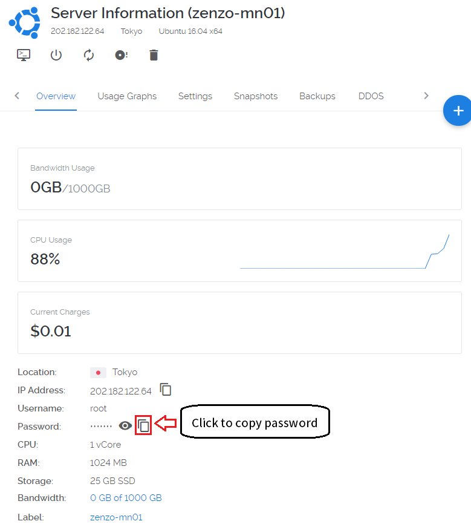

Now open PuTTY to add the server.

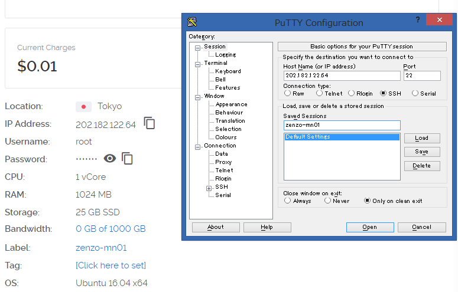

Enter the IP address in the Host Name field, and enter the server name you wish to use for this VPS (e.g., MN01) to Saved Sessions. Click save.

Click the open button. When the console has opened, click Yes in the PuTTY Security Alert box.
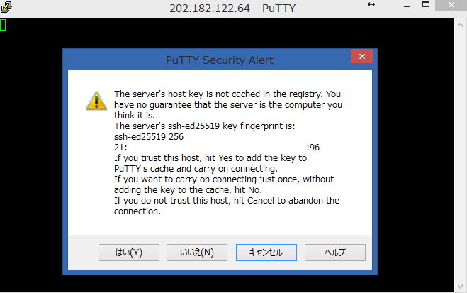

Now enter your server login details provided in your Vultr account.
You cannot Ctrl+V to paste in the console. Either right click the mouse or type shift+insert (sometimes
on keyboard it will just be INS key)

User: root
Password: (paste or type password)

When you paste it will not display, so don't try to paste again.
Just paste once and press Enter.

For Mac users, open Terminal (e.g., Press Command-Space and type Terminal and press Enter). Then type:

```
ssh -l root <IP address>
```
## Install Masternode

Login to your newly installed node as "root".

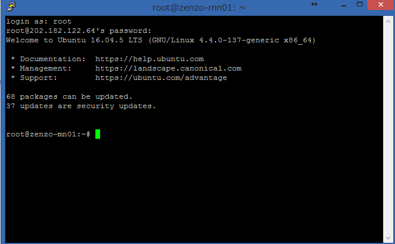

Enter this command to copy the Masternode installation script and install a single ZENZO (ZNZ) Masternode:

```bash
git clone https://github.com/Zenzo-Ecosystem/vps.git && cd vps && ./masternode_install.sh -p zenzo -g -x
```

This prepares the system and installs the ZENZO Masternode daemon. This includes downloading the latest ZENZO (ZNZ) masternode release, creating a swap file, configuring the firewall, and compiling the ZENZO (ZNZ) Masternode from source code. This process takes about 10-15 minutes.

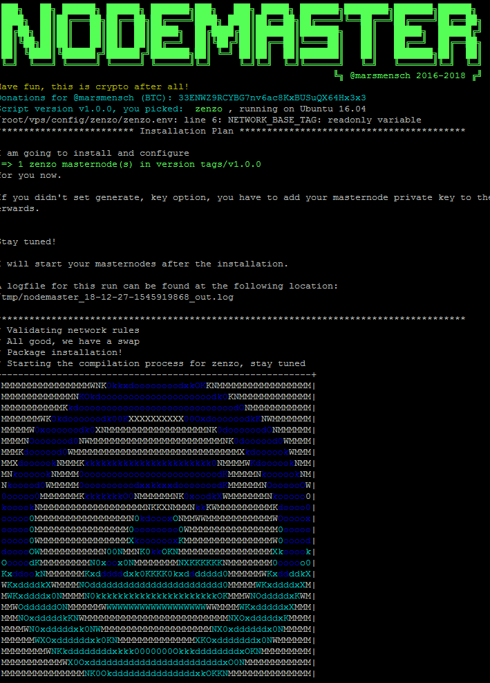

While that is underway, go back to your local desktop and open zenzo-qt.

### Pre-Input Masternode Private Key Within Installation (Generate Masternode Private Key with Step 2 Below).
 In these cases, you can skip "Configure masternode configuration files" below.
- If you already generated masternode private key,
  enter this command.
  ```bash
  git clone https://github.com/Zenzo-Ecosystem/ZENZO-Core.git && cd ZENZO-Core && ./masternode_install.sh -p zenzo -k **PRIVATE KEY**
  ```
   **PRIVATE KEY** means your generated masternode private key. For example,
  ```bash
  git clone https://github.com/Zenzo-Ecosystem/ZENZO-Core.git && cd ZENZO-Core &&  ./masternode_install.sh -p zenzo -k 87AqVXXXXXERNJxqBGdSS9LDS2vXXXXX5RdiiNd1zM7YAM7SHWX
  ```
  In this script, you can find configuration in masternode.conf in your PC.
  Enter this to check it
  ```bash
  cat /tmp/zenzo_masternode.conf
  ```
  and add these lines to your masternode.conf.

- If you want to generate masternode private key within masternode installation,
  use this command
  ```bash
  git clone https://github.com/Zenzo-Ecosystem/ZENZO-Core.git && cd ZENZO-Core && ./masternode_install.sh -p zenzo -g
  ```
  and you can check generated private key in PuTTY. In this script, you can find configuration in masternode.conf in your PC.
  Enter this to check it
  ```bash
  cat /tmp/zenzo_masternode.conf
  ```
  and add these lines to your masternode.conf.

### More Complex Situations (ignore if you are installing a single masternode on a new VPS)

If you wish to install more than one masternode on the same VPS, you can add a -c parameter to tell the script how many to configure, so for example this would install three ZENZO (ZN) masternodes (all entered on one line):

```bash
git clone https://github.com/Zenzo-Ecosystem/ZENZO-Core.git && cd ZENZO-Core && ./masternode_install.sh -p zenzo -c 3 -g -x
```

If you already have your masternode private keys, you can add them as shown below (all entered on one line):

```bash
git clone https://github.com/Zenzo-Ecosystem/ZENZO-Core.git && cd ZENZO-Core && ./masternode_install.sh -p zenzo -c 3 --key **PRIVATE KEY 01** --key2 **PRIVATE KEY 02** --key3 **PRIVATE KEY 03**
```

Using this command, you can skip the step for "Configure masternode configuration files", because the command above adds the masternode private keys to the masternode configuration files.

If you are adding a new masternode, (and if you installed 2 masternodes already)

```
git clone https://github.com/Zenzo-Ecosystem/ZENZO-Core.git && cd ZENZO-Core && ./masternode_install.sh -p zenzo -c 3 -g -x
```
if you want to use --key option, add --key3 **MASTERNODE PRIVKEY 03**. You are able to use
```
git clone https://github.com/Zenzo-Ecosystem/ZENZO-Core.git && cd ZENZO-Core && ./masternode_install.sh -p zenzo -c 3 -g -x
```
for new third masternode.

If you are upgrading your masternode(s) to a new release, you should first remove the old version of the VPS script so that the new one you download is tagged with the latest version, and then you add a -u parameter to upgrade existing nodes:

```bash
rm -rf /root/
```
```bash
git clone https://github.com/Zenzo-Ecosystem/ZENZO-Core.git && cd ZENZO-Core && ./masternode_install.sh -p zenzo -u
```

The project is configured to use the latest official release of the ZENZO (ZNZ) masternode code, and we will update this project each time a new release is issued, but without downloading the latest version of this project and using the -u parameter. The script will not update an existing ZENZO (ZNZ) node that is already installed.

## Configure ZENZO (ZNZ) Wallet
### Step1 - Create Collateral Transaction
Once the wallet is open on your local computer, generate a new receive address and label it however you want to identify your masternode rewards (e.g., ZENZOMN1). This label will show up in your transactions each time you receive a block reward.

Click the Request payment button and copy the address.

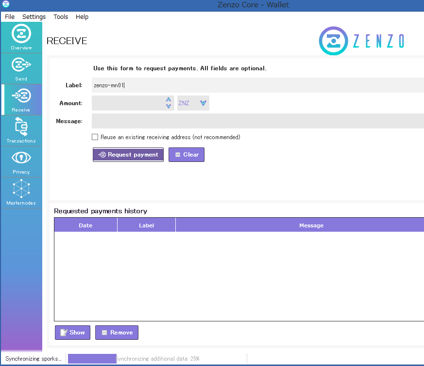

Now go to the Send tab, paste the copied address, and send *exactly* 15,000 ZNZ to it in a single transaction. Wait for it to confirm on the blockchain. This is the collateral transaction that will be locked and paired with your new masternode. If you are setting up more than one masternode at one time, repeat this process for each one.


### Step 2 - Masternode Outputs
This will give you the rest of the information you need to configure your masternode in your ZENZO (ZNZ) wallet (the transaction ID and the output index).

```bash
masternode outputs
```

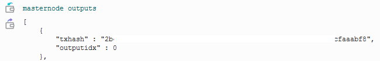

The long string of characters is the *Transaction ID* for your masternode collateral transaction. The number after the long string is the *Index*. Copy and paste these into the text file next to the private key you generated in Step 2.

If you have multiple masternodes in the same wallet and have done the 15,000 ZNZ transactions for each of them, masternode outputs will display transaction IDs and indexes for each one. You can choose which private key to go with each transaction ID and index, as long as they are all different, and you make sure the corresponding lines in masternode.conf and the VPS zenzo configuration files match (see below).

## End of Installations
When the script finishes, it will look similar to this:

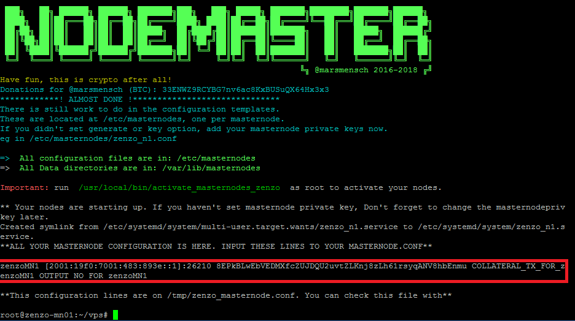

You only have a few steps remaining to complete your masternode configuration(the lines which surrounded by red lines are masternode configuration line. We will use this after).

## Finishing Wallet Configuration & Activate Masternode
## Configure Masternode Configuration Files
The script generates private key for masternode with -g option. If you chose it, you should get like
```
zenzoMN1 [2001:19f0:7001:483:893e::1]:26210 8EPkBLwEbVEDMXfcZUJDQU2uvtZLKnj8zLh61rsyqANV8hbEnmu COLLATERAL_TX_FOR_zenzoMN1 OUTPUT_NO_FOR_zenzoMN1
```

Please paste this line(s) to your masternode.conf. You can open masternode.conf with **[Tools > Open Masternode Configuration File]**.

The image below shows another example using an IPv4 IP address. If you followed this guide, you are probably using an IPv6 address that looks like the line above.

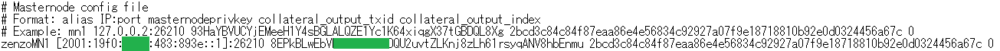

If you are running multiple masternodes, you need to add one of these lines for each masternode and make sure the private key on each line matches the corresponding private key you entered in the VPS zenzo configuration file for that masternode.

This file has the following format, with each value separated with a space:

* alias IP:Port masternodeprivatekey collateral_transaction_ID collateral_output_index
* alias - A short name you use to identify the masternode, you can choose this name as long as it is without spaces (e.g., ZENZOMN1)
* IP:Port - The IP address (either IPv6 or IPv4) and the Port where the masternode is running, separated by a colon (:). You copied this from the zenzo.conf file on the VPS.
* collateral_transaction_ID: This is the transaction ID you copied from masternode outputs.
* collateral_output_index: This is the index you copied from masternode outputs.

## Check Syncing Status of Masternode
The masternode cannot complete activation until it is fully synced with the ZENZO (ZNZ) Blockchain Network.

To check the status of your masternode, please enter this command in the VPS terminal. If you have multiple masternodes on the same VPS, you can change n1 to n2 etc. below to check the status of each one.

```bash
/usr/local/bin/zenzo-cli -conf=/etc/masternodes/zenzo_n1.conf getinfo
```
The output will look like this:
```
{
  "version": 1000000,
  "protocolversion": 70004,
  "walletversion": 61000,
  "balance": 0.00000000,
  "privatesend_balance": 0.00000000,
  "blocks": 56209,
  "timeoffset": 0,
  "connections": 14,
  "proxy": "",
  "difficulty": 42882.54964804553,
  "testnet": false,
  "moneysupply" : 11814171.53907114,
  "zZNZsupply" : {
      "1" : 263.00000000,
      "5" : 135.00000000,
      "10" : 500.00000000,
      "50" : 700.00000000,
      "100" : 1300.00000000,
      "500" : 5000.00000000,
      "1000" : 11000.00000000,
      "5000" : 90000.00000000,
      "total" : 108898.00000000
  },
  "keypoololdest" : 1507302593,
  "keypoolsize" : 1001,
  "paytxfee" : 0.00000000,
  "relayfee" : 0.00010000,
  "staking status" : "Staking Not Active",
  "errors" : ""
}
```

We're looking at the *blocks* and need that to be the latest block in the blockchain. You can check your local wallet to see the latest block by hovering over the green check mark.

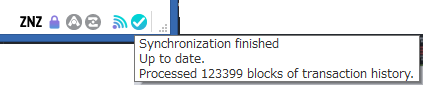

Once your masternode has synced up to the latest block, go to next step. The syncing process may take 15-30 minutes or more as the ZENZO (ZNZ) Blockchain grows. You can keep checking progress with the command above, by pressing the up arrow and Enter to repeat it.

## Start Masternode
Go to the debug console of your ZENZO (ZNZ) wallet **[Tools->Debug Console]** and enter the following command, replacing **mn-alias** with the name of the masternode in the Alias column of the Masternodes tab:

```
startmasternode alias false mn-alias
```

You may need to unlock the wallet **[Settings->Unlock Wallet]** before you run this command, entering your passphrase. You can lock the wallet after it is finished.

If everything was setup correctly after entering the command, you will see something like this:
```
{
"overall" : "Successfully started 1 masternodes, failed to start 0, total 1",
"detail" : {
"status" : {
"alias" : "zenzo-mn01",
"result" : "successful"
}
```
If you are setting up multiple masternodes, repeat this for each one. You can now close the debug console, return to the Masternodes tab and check the status:


It should say ENABLED, and within an hour, the timer in the Active column should start increasing.

Congratulations! Your ZENZO (ZNZ) masternode is now set up and running! Depending on how many masternodes there are, it may take 12-24 hours before you see your first masternode reward. This is normal and rewards should come at more regular intervals after the first one.

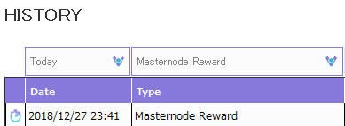


## Configure Masternode Configuration Files *Manually*
If you didn't use the *-g* option, since this installation method supports multiple masternodes, the ZENZO configuration files have a node number added to them (e.g., zenzo_n1.conf, zenzo_n2.conf), stored in the /etc/masternodes directory. If you have a single masternode on the VPS, you will only need to edit /etc/masternodes/zenzo_n1.conf.

To open zenzo_n1.conf for editing, enter these commands:
```bash
sudo apt-get install nano
nano /etc/masternodes/zenzo_n1.conf
```
The next step adds your masternode private key.

## Add Masternode Private Key *Manually*
If you didn't use the *-g* option, what you need to change is only masternode private key.
(We recommend using IPv6 which is the default, but if you choose IPv4 when you ran the installation script, please edit #NEW_IPv4_ADDRESS_FOR_MASTERNODE_NUMBER to your VPS IP address).
After typing
```
nano /etc/masternodes/zenzo_n1.conf
```

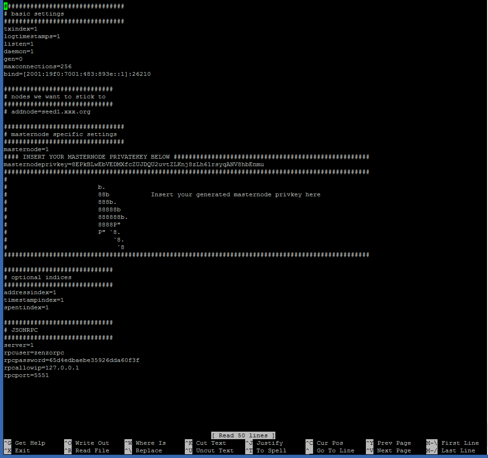

Copy the masternode private key from the text file you saved it in, and replace HERE_GOES_YOUR_MASTERNODE_KEY_FOR_MASTERNODE_zenzo_1 with that private key (this typically begins with an 8).

While you have this file opened, copy the information that follows after masternodeaddr=, starting with the open bracket. This is the masternode's IPv6 address and port, and will be needed for the wallet's masternode.conf file.

Once you have your masternode private key entered, press <font color="Green">Ctrl+X</font> .
Then press <font color="Green">Y</font> to save, and press Enter to exit.

Finally, close and restart your ZENZO wallet so that it will have the new masternode configuration.

## Start Your Masternodes *Manually*
A script for starting all masternodes on the VPS has been created at /usr/local/bin/activate_masternodes_zenzo.sh.
Run this command after your masternode configuration written above.

```bash
/usr/local/bin/activate_masternodes_zenzo
```

The masternode daemons will start and begin loading the ZENZO (ZNZ) Blockchain.

## Tips
 You can start and stop masternode client manually. Enter this commands.

### Check Masternode Status on the VPS
You can check your masternode status on VPS. Use this command.

 ```
 /usr/local/bin/zenzo-cli -pid=/var/lib/masternodes/zenzo1/zenzo.pid -conf=/etc/masternodes/zenzo_n1.conf -datadir=/var/lib/masternodes/zenzo1 masternode status
 ```
 If it returns
 ```
 {
   "txhash": "a7eba991be786ce80948e9099e26f6a816317b2142f9e5e12abea357f885d0f2",
   "outputidx": 1,
   "netaddr": "[2001:0000:5c01:457:2044::6]:26210",
   "addr": "ZEtMbHEuqo1QHs7Xy2wCTTmugAuemyd2mU",
   "status": 4,
   "message": "Masternode successfully started"
 }
 ```

 like this, Your masternode is successfully started (Please check txhash, outputidx are same as your masternode.conf).

### To Stop
```
/usr/local/bin/zenzo-cli -pid=/var/lib/masternodes/zenzo1/zenzo.pid -conf=/etc/masternodes/zenzo_n1.conf -datadir=/var/lib/masternodes/zenzo1 stop
```
if use above command, masternode client will restart automatically in 5sec.
To stop completely,
```
service zenzo_n1 stop
```

### To Start
```
/usr/local/bin/zenzod -daemon -pid=/var/lib/masternodes/zenzo1/zenzo.pid -conf=/etc/masternodes/zenzo_n1.conf -datadir=/var/lib/masternodes/zenzo1
```

If you stopped service "zenzo_n1", use
```
service zenzo_n1 start
```

## Options of This Script
The _masternode_install.sh_ script support the following parameters:

 | Long Option  | Short Option | Values              | Description                                                         |
 | :----------- | :----------- | ------------------- | ------------------------------------------------------------------- |
 | --project    | -p           | project, ex. "zenzo"| shortname for the project                                           |
 | --net        | -n           | "4" / "6"           | ip type for masternode. (ipv)6 is default                           |
 | --release    | -r           | e.g. "tags/v1.0.0"  | a specific git tag/branch, defaults to latest tested                |
 | --count      | -c           | number              | amount of masternodes to be configured                              |
 | --update     | -u           | --                  | update specified masternode daemon, combine with -p flag            |
 | --sentinel   | -s           | --                  | install and configure sentinel for node monitoring                  |
 | --wipe       | -w           | --                  | uninstall & wipe all related master node data, combine with -p flag |
 | --help       | -h           | --                  | print help info                                                     |
 | --startnodes | -x           | --                  | starts masternode(s) after installation                             |
 | --key        | -k           | masternode privkey  | preinput masternode private key to configuration files              |
 | --generate   | -g           | --                  | generate and preinput masternode private key                        |

## Issues and Questions
Please open a GitHub Issue if there are problems with this installation method. The ZENZO Team and community actively support people installing masternodes and can provide assistance in the ZENZO Discord channel.
Here is a Discord invitation:

https://discord.gg/hUDDV8H
